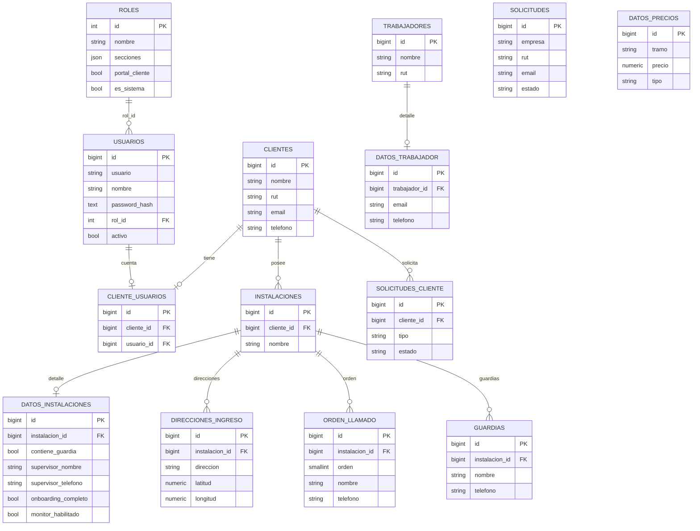

# NEO · Modelo de base de datos (ERD)

## Relaciones

- **roles 1—N usuarios**: cada usuario tiene un rol que define las secciones que puede ver.
- **clientes 1—1 usuarios** (vía `cliente_usuarios`): la cuenta de acceso del cliente.
- **clientes 1—N instalaciones**: un cliente puede tener varias instalaciones.
- **instalaciones 1—1 datos_instalaciones**: datos de onboarding (guardia, supervisor, estado).
- **instalaciones 1—N direcciones_ingreso / orden_llamado / guardias**.
- **clientes 1—N solicitudes_cliente**.
- **trabajadores 1—1 datos_trabajador**.
- **datos_precios**: tramos de precios (cámaras / implementación).

## Seed

- Rol **Administrador** (`id=1`) con todas las secciones.
- Rol **Cliente** (`id=2`) solo portal.
- Usuario **admin** / contraseña **admin** (hash `salt:sha256`), rol Administrador.

> El esquema está en `db/neo-schema.sql` (PostgreSQL).
